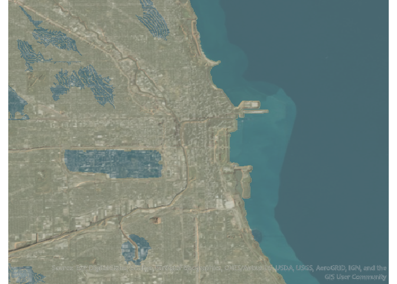

<!-- README.md is generated from README.Rmd. Please edit that file -->

# spacey: Easily retrieve elevations and textures for rayshader mapping

<!-- badges: start -->

[](https://CRAN.R-project.org/package=spacey)
[](https://www.tidyverse.org/lifecycle/#experimental)
<!-- badges: end -->

``` r
library(spacey)
automap_2d(lat = 42.3601, lng = -71.0589)
```



The goal of `spacey` is to make it easy to work with packages like
[rayshader](https://www.rayshader.com/index.html) in order to create
beautiful landscape visualizations, pulling source data from the USGS
for elevation profiles and ESRI for textures to quickly create maps for
the area relevant to your analysis.

## Installation

If the CRAN version badge above is green, you can install the released
version of `spacey` from [CRAN](https://CRAN.R-project.org) with:

``` r
install.packages("spacey")
```

You can always get the most up-to-date development version with:

``` r
# install.packages("devtools")
devtools::install_github("mikemahoney218/spacey")
```

## Functions

At the moment, `spacey` consists mainly of the following functions:

  - `automap_2d` uses a combination of sensible defaults to produce
    attractive square map outputs from a single central point location.
  - `get_coord_bounding_box` finds the smallest rectangle required to
    contain a list of lat/long coordinates.
  - `get_centroid_bounding_box` finds the corners of a square with
    diagonals a set distance from a central point, enabling map creation
    for a single central lat/long combination.
  - `get_centroid` finds the central point for matched vectors of
    latitude and longitude.
  - `get_heightmap` retrives an elevation map from the USGS for a
    specified boundary box and translates it into an R matrix.
  - `get_image_overlay` retrieves a texture from ESRI for a specified
    boundary box and translates it into a matrix.

It also includes several helper functions, including:

  - `load_heightmap` can import stored .tif files in order to used saved
    USGS national map data (or potentially other sources).
  - `load_overlay` is an *extremely* thin wrapper around
    [png::readPNG](http://www.rforge.net/png/), used to read stored ESRI
    image overlay files.

## Limitations

At the moment, `spacey` is only able to retrieve data from the USGS
National Map API, limiting its use to the United States. If you have a
good API for other regions, open an issue or submit a PR\!

Similarly, most geospatial calculations implemented in this package
don’t deal well with areas near the poles or Prime Meridian. Given the
spatial constraints of the USGS dataset, this isn’t a problem for
current use cases, but be careful extending these functions outside of
this package.
