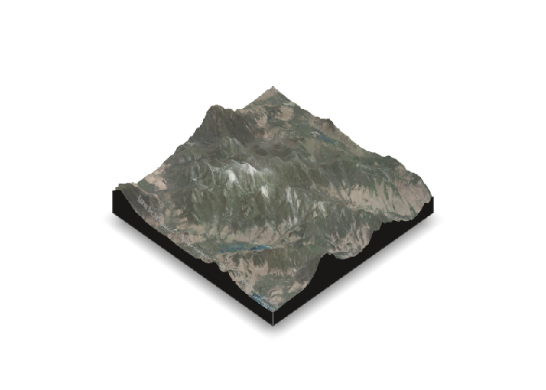

<!-- README.md is generated from README.Rmd. Please edit that file -->
spacey: Easy data retrieval and helpful defaults for rayshader mapping
======================================================================

<!-- badges: start -->

<!-- badges: end -->

The `spacey` package provides three main functions to make it easy to
quickly build beautiful maps of locations in the United States via the
`[rayshader](https://github.com/tylermorganwall/rayshader)` package.
First off, it provides an `automap` function to quickly make maps using
data from the USGS national map:

    library(spacey)
    automap(44.121268, -73.903734)

As well as letting you incorporate overlay textures from ESRI’s
MapServer API:

    automap(44.121268, -73.903734, overlay = "World_Imagery")

And optionally even turn these into 3D visualizations:

    automap(44.121268,
      -73.903734,
      overlay = "World_Imagery",
      method = "3d",
      zoom = 10
    )

And while `automap` tries to make it easy to configure these maps,
`spacey` also lets you save off your heightmaps and overlays directly,
either through arguments to `automap` or the functions `get_heightmap`
and `get_overlay`, so that you can work directly with `rayshader` to
make these maps by yourself.

There’s a lot more to these three functions, alongside a few basic
geospatial utilities `spacey` implements to make it easier to make maps
from your data. For more information, check out the [introductory
vignette](https://mikemahoney218.github.io/spacey/articles/introduction-to-spacey.html)!
\#\# Installation

If the CRAN version badge above is green, you can install the released
version of `spacey` from [CRAN](https://CRAN.R-project.org) with:

    install.packages("spacey")

You can always get the most up-to-date development version with:

    # install.packages("devtools")
    devtools::install_github("mikemahoney218/spacey")

Functions
---------

At the moment, `spacey` consists mainly of the following functions:

-   `automap` uses a combination of sensible defaults to produce
    attractive square map outputs from a single central point location.
-   `get_heightmap` retrives an elevation map from the USGS for a
    specified boundary box and translates it into an R matrix.
-   `get_image_overlay` retrieves a texture from ESRI for a specified
    boundary box and translates it into a matrix.

It also includes several helper functions, including:

-   `get_coord_bounding_box` finds the smallest rectangle required to
    contain a list of lat/long coordinates.
-   `get_centroid_bounding_box` finds the corners of a square with
    diagonals a set distance from a central point, enabling map creation
    for a single central lat/long combination.
-   `get_centroid` finds the central point for matched vectors of
    latitude and longitude.
-   `load_heightmap` can import stored .tif files in order to used saved
    USGS national map data (or potentially other sources).
-   `load_overlay` is an *extremely* thin wrapper around
    [png::readPNG](http://www.rforge.net/png/), used to read stored ESRI
    image overlay files.

Limitations
-----------

At the moment, `spacey` is only able to retrieve data from the USGS
National Map API, limiting its use to the United States. If you have a
good API for other regions, open an issue or submit a PR!

Similarly, most geospatial calculations implemented in this package
don’t deal well with areas near the poles or Prime Meridian. Given the
spatial constraints of the USGS dataset, this isn’t a problem for
current use cases, but be careful extending these functions outside of
this package.
