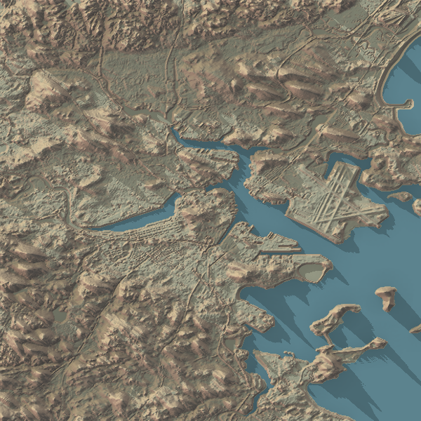

```{r, include = FALSE}
knitr::opts_chunk$set(
  collapse = TRUE,
  comment = "#>"
)
```

`spacey` is a package designed to make it trivial to produce beautiful 
[rayshader](https://www.rayshader.com/) maps for locations in the United States,
letting you easily obtain and combine USGS and ESRI map data into 2D (and 
eventually 3D) images. This vignette will walk through the basic utilities
in `spacey` and their expected uses.

First, let's load our package:

```{r setup}
library(spacey)
```

The most comprehensive command in `spacey` is `automap_2d`, which only requires 
two vectors, one for latitude and one for longitude^[This package follows 
[ISO 6709](https://en.wikipedia.org/wiki/ISO_6709) convention of representing 
spatial data in the format (latitude, longitude), as opposed to the somewhat 
popular (longitude, latitude) format.], in order to quickly generate a 2D 
raytracer image. In fact, you can use as little as a single coordinate pair:

```r
automap_2d(lat = 42.3601, lng = -71.0589)
```

```{r, include=FALSE}

```

Behind the scenes, automap is doing a few different things that we'll discuss 
separately:

* First, `automap_2d` looks at your coordinates (alongside other optional 
arguments) to determine how large a map should be drawn, calling a few 
`spacey` functions built for geospatial data processing along the way
* Next, `automap_2d` uses that information to query the 
  [USGS National Map](https://www.usgs.gov/core-science-systems/national-geospatial-program/national-map)
  and [ESRI REST API](https://developers.arcgis.com/rest/) (no keys required) in
  order to download elevation and optionally image data for the relevant area
* Finally, `automap_2d` takes that data and creates a rayshader map using 
  sensible defaults, resulting in maps similar to the one above.

We'll run through each of those steps as separate sections. 

## Geospatial Data Processing

There are a few simple geospatial processing commands baked into `spacey` in 
order to figure out where exactly we should be making maps of. These functions 
are called early on by the automap process to determine the relevant spatial 
extent for your data, and include the following:

* `get_centroid` will calculate the center of a set of points. For instance, 
  let's say we had a dataset of two coordinate pairs -- we could find the 
  central point between them like so:
  
```{r}
get_centroid(lat = c(42.35375, 42.36645), lng = c(-71.06750, -71.05030))
```

Note that I'm using decimal degrees throughout this vignette. `spacey` also has 
built-in support for measurements in radians, using the argument 
`coord.unit = "radians"` in relevant functions. You can also transform your 
coordinates yourself using the convenience functions `deg_to_rad` and 
`rad_to_deg`, if necessary. There is currently no support for 
degree-minute-second format.

* `get_coord_bounding_box` will find the bounding box for a set of coordinates 
  (any length of latitude/longitude pairs), in order to pull the right area for 
  your output map. For instance, we can use our same coordinates as above to 
  find the edges of our data:

```{r}
get_coord_bounding_box(
  lat = c(42.35375, 42.36645),
  lng = c(-71.06750, -71.05030)
)
```

All `spacey` functions deal with boundary boxes via their bottom left 
(minimum latitude, minimum longitude) and top right (maximum latitude, 
maximum longitude) corners, named "bl" and "tr" in package outputs.

* Finally, `get_centroid_bounding_box` will find the square bounding box for a 
  set of central coordinates, with each corner a set distance away from the 
  central point. For example, we can plug in the centroid we calculated earlier 
  and ask for the corners 1 kilometer away like so:

```{r}
get_centroid_bounding_box(c("lat" = 42.3601, "lng" = -71.0589), distance = 1)
```

All `spacey` functions with distance arguments by default assume your units to 
be in kilometers. You can change this behavior by passing an argument to 
`dist.unit` -- currently, the other acceptable values are `miles`, `m` for 
meters, and `ft` for feet.

Calling `autoplot_2d` with only two coordinates (that is, a single 
latitude/longitude pair) will use `get_centroid_bounding_box` to find a suitable 
square to map for your provided location. Using more than two coordinates will 
do one of two things, depending on the value you provide to the `distance` 
argument:

* A `distance` argument of 0 or `NA` will call `get_coord_bounding_box` and
  then map the smallest rectangle that fits your data
* Any other `distance` argument will then call `get_centroid`, followed by 
  `get_centroid_bounding_box`, mapping a square of the specified distance around
  your data's central location
  
It should be noted that `spacey` really isn't a geospatial processing library, 
and these commands are built to be exactly as accurate as needed by core package
functions. For that reason, you probably shouldn't rely upon `get_centroid` or 
`get_*_bounding_box` for points near extreme latitudes or longitudes, as there
are no adjustments built in to deal with these locations, since the USGS data 
`spacey` is designed to work with doesn't really wrap those. 

## API Access

The next suite of functions provided by `spacey` are the API access functions, 
which will pull data for your region from the USGS National Map and (optionally)
the ESRI public API. A huge thank-you is in order here to 
[Will Bishop](https://wcmbishop.github.io/rayshader-demo/), whose essay on using
`rayshader` laid the groundwork for a lot of the API access code contained in 
this package.

There are two main functions used to access these APIs:

* `get_heightmap` retrieves the USGS digital elevation model for the specified 
  area, returning a raster matrix.
* `get_image_overlay` retrives the ESRI image texture for the specified area, 
  returning a PNG matrix.

Both of these functions are essentially identical, taking a bounding box 
(like the ones produced by `get_*_bounding_box`) and returning a matrix object
which can be used by `rayshader` functions. 
The basic syntax for `get_heightmap` is as simple as this:

```r
bounding_box <- get_centroid_bounding_box(c("lat" = 42.3601, 
                                            "lng" = -71.0589), 
                                          distance = 10)
heightmap <- get_heightmap(bounding_box)
```

The syntax for `get_image_overlay` is almost as simple -- the only difference is 
an additional parameter, `overlay`, which specifies which ESRI basemap to pull 
the data for:

```r
overlay <- get_image_overlay(bounding_box, overlay = "World_Imagery")
```

You can also optionally save each 
object into a file (using `save.tif` and `tif.filename` in `get_heightmap` and 
`save.png` plus `png.filename` in `get_image_overlay`), letting you retrieve 
the data later without having to ping the API (or worry about the data changing 
between runs!). You can them reimport those files using either `load_heightmap` 
for `.tif` files, or `load_overlay` for `.png` basemaps.

## Mapping

At this point, with our data imported into R, we're more than able to run our 
data through `rayshader` in order to create beautiful, hand-tailored maps. In 
fact, we can entirely replicate the map we started with by chaining together 
a few steps:

```r
library(rayshader)
heightmap %>%
  sphere_shade(texture = "imhof4") %>%
  add_water(detect_water(heightmap), color = "imhof4") %>%
  add_shadow(ray_shade(heightmap, zscale = 0.3, lambert = TRUE), 
             max_darken = 0.5) %>%
  add_shadow(ambient_shade(heightmap, zscale = 0.3), max_darken = 0.5) %>%
  plot_map()
```

```{r, include=FALSE}

```


We can even add our overlay with just a single additional step:

```r
heightmap %>%
  sphere_shade(texture = "imhof4") %>%
  add_water(detect_water(heightmap), color = "imhof4") %>%
  add_shadow(ray_shade(heightmap, zscale = 0.3, lambert = TRUE), max_darken = 0.5) %>%
  add_shadow(ambient_shade(heightmap, zscale = 0.3), max_darken = 0.5) %>%
  add_overlay(overlay, alphalayer = 0.75) %>%
  plot_map()
```

```{r, include=FALSE}
knitr::include_graphics("boston_overlay.png")
```


My guess is that most people who use `spacey` will eventually move on to 
carefully designing their output maps, since you're able to control things with 
much more granularity using the core `rayshader` functions than you are 
with anything in `spacey`. 

However, the automapping facilities in `spacey` can let you 
iterate on your design more quickly, testing out different shadings, 
overlays, and colorations before moving on to more thorough map detailing using
`rayshader` directly. Right now, the only function in `spacey` in this category 
is `automap_2d`, which will let you customize most `rayshader` variables in a 
single function call:

```r
automap_2d(lat = 42.3601, 
           lng = -71.05, 
           distance = 20,
           overlay = "World_Terrain_Base", 
           colorscale = c("water" = "unicorn", "land" = "bw"),
           overlay.alpha = 0.3) %>%
  save_png("boston_rainbow.png")
```

```{r, include=FALSE}
knitr::include_graphics("boston_rainbow.png")
```

The hope is that by providing sensible defaults to iterate on and easy access 
to data, `spacey` will help you make more and better maps, letting you prototype
your ideas before committing to a design and helping you better understand your 
study system and the world we live in.

## Acknowledgements

`rayshader`, which powers the maps coming out of `automap_2d`, was built by 
[Tyler Morgan-Wall](https://www.tylermw.com/), and can be extended _far_ 
beyond what I've done here -- check out 
[its main website.](https://www.rayshader.com/)

The USGS and ESRI query code has its roots in 
[Will Bishop's fantastic essay](https://wcmbishop.github.io/rayshader-demo/) on 
using `rayshader`.
